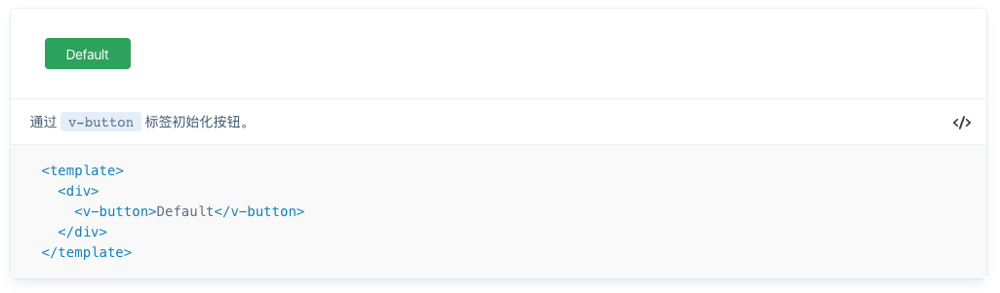
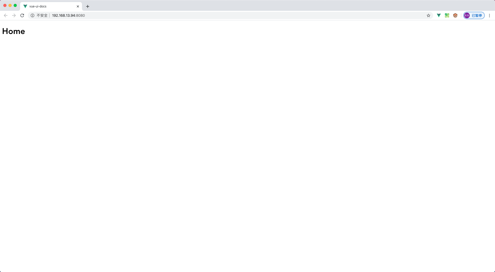

# VUE-DOCS

代码示例格式：

````markdown
:::snippet 通过 `v-button` 标签初始化按钮。

```html
<template>
  <div>
    <v-button>Default</v-button>
  </div>
</template>
```

:::
````

解析示例渲染：



## 结构调整

1. 文件结构调整

```javascript
├─site          //示例网站目录
│ └─components  //示例网站组件
│ └─router      //路由配置
│ │ └─index.js  //路由配置文件
│ └─views       //示例页面
│ │ └─Home.vue  //示例网站首页
│ └─App.vue     //项目入口
│ └─main.js     //启动文件
├─src           //源码目录
```

2. 根目录创建 `vue.config.js` 配置

```javascript
module.exports = {
  pages: {
    index: {
      entry: "site/main.js",
    },
  },
};
```

3. 相关的依赖、路由配置进行调整，`Home.vue` 页面调整

```vue
<template>
  <h1>Home</h1>
</template>

<script>
export default {
  name: "Home",
};
</script>
```

4. 页面访问



## 组件开发

1. `Button` 组件开发

```html
<template>
  <button v-bind="$attrs" class="v-button" type="button" @click="handleClick">
    <span class="v-buttov--text">
      <slot>{{ text }}</slot>
    </span>
  </button>
</template>

<script>
  export default {
    name: "VButton",
    props: {
      text: String,
    },
    methods: {
      handleClick(event) {
        this.$emit("click", event);
      },
    },
  };
</script>

<style lang="scss">
  .v-button {
    position: relative;
    display: inline-block;
    font-weight: 400;
    white-space: nowrap;
    text-align: center;
    background-image: none;
    border: 1px solid #41a259;
    background-color: #41a259;
    box-shadow: 0 2px 0 rgba(0, 0, 0, 0.015);
    transition: all 0.3s;
    user-select: none;
    height: 32px;
    min-width: 88px;
    padding: 0 16px;
    font-size: 14px;
    border-radius: 4px;
    color: #ffffff;
    outline: 0;
    font-family: inherit;
    cursor: pointer;

    &:active,
    &:focus {
      outline: 0;
    }
  }
</style>
```

2. 安装配置 `src/button/index.js`

```javascript
import Button from "./src/button";

Button.install = (Vue) => {
  Vue.component(Button.name, Button);
};

export default Button;
```

3. 组件集成安装 `src/index.js`

```javascript
import Button from "./button/index.js";

const components = [Button];

const install = (Vue) => {
  components.forEach((component) => {
    Vue.use(component);
  });
};

export default {
  install,
};
```

4. 入口文件引入 `site/main.js`

```javascript
import VueUIDocs from "../src/index";
Vue.use(VueUIDocs);
```

# vue-docs
vue-docs


>>>>>>> .theirs
