# JavaScript 正则表达式迷你书 

`javascript-regular-expressions-mini-book`

笔记：感谢这本📕的作者

正则表达式是**匹配模式**，要么**匹配字符**，要么**匹配位置**

对于位置的理解，我们可以理解成**空字符**

第一章 正则表达式**字符匹配**攻略

第二章 正则表达式**位置匹配**攻略

第三章 正则表达式**括号的作用**

第四章 正则表达式**回溯法原理**

第五章 正则表达式的**拆分** 

第六章 正则表达式的**构建**

第七章 正则表达式**编程**

### 每一章都讨论了什么？

> 正则是**匹配模式**，要么**匹配字符**，要么**匹配位置**。

第一章和第二章以这个角度去讲解了正则表达式的基础。

> 在正则可以**使用括号捕获数据**，要么在 `API` 中进行**分组引用**，要么在正则里进行**反向引用**。

第三章的主题，讲解了正则表达式中**括号的作用**。

> 学习正则，是需要了解其匹配原理的。

第四章，讲解了正则表达式的**回溯法原理**。

第五章，是从读的角度，去**拆分一个正则表达式**，而第六章是从写的角度，去**构建一个正则表达式**。

第七章讲解了**正则的用法**，和相关 `API` 需要注意的地方。

## 第一章 正则表达式**字符匹配**攻略

> 正则表达式是**匹配模式**，要么**匹配字符**，要么**匹配位置**。

元字符太多了，看起来没有系统性，不好记。

内容包括：

**两种模糊匹配**

**字符组**

**量词**

**分支结构**

**案例分析**

### 1.1. 两种模糊匹配

如果正则只有精确匹配是没多大意义的，比如 `/hello/`，也只能匹配字符串中的 `"hello"` 这个子串。

```js
var regex = /hello/;
console.log( regex.test("hello") );
// => true
```

正则表达式之所以强大，是因为其能实现模糊匹配。 而模糊匹配，有两个方向上的“模糊”：横向模糊和纵向模糊。

#### 1.1.1. 横向模糊匹配

横向模糊指的是，一个正则可匹配的字符串的长度不是固定的，可以是多种情况的。

其实现的方式是**使用量词**。譬如 `{m,n}`，表示连续出现最少 `m` 次，最多 `n` 次。

比如正则 `/ab{2,5}c/` 表示匹配这样一个字符串：第一个字符是 "`a`"，接下来是 `2` 到 `5` 个字符 "`b`"，最后
是字符 "`c`"。

测试如下：
```js
var regex = /ab{2,5}c/g;
var string = "abc abbc abbbc abbbbc abbbbbc abbbbbbc";
console.log( string.match(regex) );
// => ["abbc", "abbbc", "abbbbc", "abbbbbc"]
```

> NOTE

:::tip
案例中用的正则是 `/ab{2,5}c/g`，其中 `g` 是正则的一个修饰符。表示全局匹配，即，在目 标字符串中按顺序找到满足匹配模式的所有子串，强调的是“所有”，而不只是“第一个” `。g` 是单词 `global` 的首字母。
:::

#### 1.1.2. 纵向模糊匹配

纵向模糊指的是，一个正则匹配的字符串，具体到某一位字符时，它可以不是某个确定的字符，可以有多种可能。

:::warning
其实现的方式是使用**字符组**。
:::

譬如 `[abc]`，表示该字符是可以字符 `"a"、"b"、"c"` 中的任何一个。
比如 `/a[123]b/` 可以匹配如下三种字符串： `"a1b"、"a2b"、"a3b"`

测试如下：
```js
var regex = /a[123]b/g;
var string = "a0b a1b a2b a3b a4b";
console.log( string.match(regex) );
// => ["a1b", "a2b", "a3b"]
```

以上就是本章讲的主体内容，只要掌握横向和纵向模糊匹配，就能解决很大部分正则匹配问题。

### 1.2. 字符组 

需要强调的是，虽叫**字符组**（字符类），但只是其中一个字符。 例如 `[abc]`，表示匹配一个字符，它可以是 `"a"、"b"、"c"` 之一。

#### 1.2.1. 范围表示法

如果字符组里的字符特别多的话，怎么办？可以使用范围表示法。

比如 `[123456abcdefGHIJKLM]`，可以写成 `[1-6a-fG-M]`。用连字符 - 来省略和简写。

因为连字符有特殊用途，那么要匹配 `"a"、"-"、"z"` 这三者中任意一个字符，该怎么做呢？

不能写成 `[a-z]`，因为其表示小写字符中的任何一个字符。

可以写成如下的方式：`[-az]` 或 `[az-] 或 [a\-z]`。 即要么放在开头，要么放在结尾，要么转义。总之不会让引擎认为是范围表示法就行了。

#### 1.2.2. 排除字符组 

纵向模糊匹配，还有一种情形就是，某位字符可以是任何东西，但就不能是 `"a"、"b"、"c"`。

此时就是**排除字符组**（反义字符组）的概念。例如 `[^abc]`，表示是一个除 `"a"、"b"、"c"`之外的任意一个字 符。字符组的第一位放 `^`（**脱字符**），表示求反的概念。

当然，也有相应的范围表示法。

#### 1.2.3. 常见的简写形式

有了字符组的概念后，一些常见的符号我们也就理解了。因为它们都是系统自带的简写形式。

| 字符组 | 具体含义                                                                                                                                                                         |
| ------ | -------------------------------------------------------------------------------------------------------------------------------------------------------------------------------- |
| `\d`   | 表示 `[0-9]`。表示是**一位数字**。 记忆方式：其英文是 `digit（数字）。`                                                                                                          |
| `\D`   | 表示 `[^0-9]`。表示**除数字外的任意字**符。                                                                                                                                      |
| `\w`   | 表示 `[0-9a-zA-Z_]`。表示**数字、大小写字母和下划线**。 记忆方式：`w` 是 `word` 的简写，也称**单词字符**。                                                                       |
| `\W`   | 表示 `[^0-9a-zA-Z_]`。**非单词字符**。                                                                                                                                           |
| `\s`   | 表示 `[ \t\v\n\r\f]`。表示**空白符**，包括**空格、水平制表符、垂直制表符、换行符、回车符、换页符**。记忆方式：`s` 是 `space` 的首字母，空白符的单词是 `white space`。            |
| `\S`   | 表示 `[^ \t\v\n\r\f]`。 **非空白符**。                                                                                                                                           |
| `.`    | 表示 `[^\n\r\u2028\u2029]`。通配符，表示几乎任意字符。**换行符、回车符、行分隔符和段分隔符除外**。 记忆方式：想想省略号 `…` 中的每个点，都可以理解成占位符，表示任何类似的东西。 |

如果要匹配任意字符怎么办？可以使用 `[\d\D]、[\w\W]、[\s\S] 和 [^]` 中任何的一个。

### 1.3. 量词

量词也称重复。掌握 `{m,n}` 的准确含义后，只需要记住一些简写形式。

#### 1.3.1. 简写形式

| 量词   | 具体含义                                                                                                                    |
| ------ | --------------------------------------------------------------------------------------------------------------------------- |
| `{m,}` | 表示至少出现 `m` 次。                                                                                                       |
| `{m}`  | 等价于 `{m,m}`，表示出现 `m` 次。                                                                                           |
| `?`    | 等价于 `{0,1}`，表示**出现或者不出现**。记忆方式：问号的意思表示，有吗？                                                    |
| `+`    | 等价于 `{1,}`，表示**出现至少一次**。 记忆方式：加号是追加的意思，得先有一个，然后才考虑追加。                              |
| `*`    | 等价于 `{0,}`，表示**出现任意次**，有可能不出现。记忆方式：看看天上的星星，可能一颗没有，可能零散有几颗，可能数也数不过来。 |

#### 1.3.2. 贪婪匹配与惰性匹配

看如下的例子：
```js
var regex = /\d{2,5}/g;
var string = "123 1234 12345 123456";
console.log( string.match(regex) );
// => ["123", "1234", "12345", "12345"]
```
其中正则 `/\d{2,5}/`，表示数字连续出现 `2` 到 `5` 次。会匹配 `2 位、3 位、4 位、5 位`连续数字。

但是其是贪婪的，它会尽可能多的匹配。你能给我 `6` 个，我就要 `5` 个。你能给我 `3` 个，我就要 `3` 个。

反正只要在能力范围内，越多越好。 我们知道有时贪婪不是一件好事。而惰性匹配，就是尽可能少的匹配：
```js
var regex = /\d{2,5}?/g;
var string = "123 1234 12345 123456";
console.log( string.match(regex) );
// => ["12", "12", "34", "12", "34", "12", "34", "56"]
```
其中 `/\d{2,5}?/` 表示，虽然 2 到 5 次都行，当 2 个就够的时候，就不再往下尝试了。

通过在量词后面加个问号就能实现惰性匹配，因此所有惰性匹配情形如下：

| 惰性量词 | 贪婪量词 |
| -------- | -------- |
| `{m,n}?` | `{m,n}`  |
| `{m,}?`  | `{m,}`   |
| `??`     | `?`      |
| `+?`     | `+`      |
| `*?`     | `*`      |

:::tip
TIP 对惰性匹配的记忆方式是：量词后面加个问号，问一问你知足了吗，你很贪婪吗？
:::

### 1.4. 多选分支

一个模式可以实现横向和纵向模糊匹配。而多选分支可以支持多个子模式任选其一。

具体形式如下：`(p1|p2|p3)`，其中 `p1、p2 和 p3` 是子模式，用 `|`（管道符）分隔，表示其中任何之一。

例如要匹配字符串 "`good`" 和 "`nice`" 可以使用 `/good|nice/`。

测试如下：
```js
var regex = /good|nice/g;
var string = "good idea, nice try.";
console.log( string.match(regex) );
// => ["good", "nice"]
```
但有个事实我们应该注意，比如我用 `/good|goodbye/`，去匹配 `"goodbye"` 字符串时，结果是 `"good"`：

```js
var regex = /good|goodbye/g;
var string = "goodbye";
console.log( string.match(regex) );
// => ["good"]
```

而把正则改成 `/goodbye|good/`，结果是：

```js
var regex = /goodbye|good/g;
var string = "goodbye";
console.log( string.match(regex) );
// => ["goodbye"]
```

也就是说，分支结构也是惰性的，即当前面的匹配上了，后面的就不再尝试了。

### 1.5. 案例分析

匹配字符，无非就是字符组、量词和分支结构的组合使用罢了。

下面找几个例子演练一下（其中，每个正则并不是只有唯一写法）：

#### 1.5.1. 匹配 16 进制颜色值 要求匹配：

```js
#ffbbad
#Fc01DF
#FFF
#ffE
```

分析： 表示一个 16 进制字符，可以用字符组 `[0-9a-fA-F]`。

其中字符可以出现 3 或 6 次，需要是用量词和分支结构。

使用分支结构时，需要注意顺序。

正则如下：

```js
var regex = /#([0-9a-fA-F]{6}|[0-9a-fA-F]{3})/g;
var string = "#ffbbad #Fc01DF #FFF #ffE";
console.log( string.match(regex) );
// => ["#ffbbad", "#Fc01DF", "#FFF", "#ffE"]
```

#### 1.5.2. 匹配时间

以 24 小时制为例。 要求匹配：

```js
23:59
02:07
```

分析： 

共 4 位数字，第一位数字可以为 `[0-2]`。 

当第 1 位为 "2" 时，第 2 位可以为 `[0-3]`，其他情况时，第 2 位为 `[0-9]`。 

第 3 位数字为 `[0-5]`，第4位为 `[0-9]`。

正则如下：

```js
var regex = /^([01][0-9]|[2][0-3]):[0-5][0-9]$/;
console.log( regex.test("23:59") );
console.log( regex.test("02:07") );
// => true
// => true
```

NOTE 正则中使用了 `^` 和 `$`，分别表示字符串开头和结尾。

如果也要求匹配 `"7:9"`，也就是说时分前面的 `"0"` 可以省略。

此时正则变成：

```js
var regex = /^(0?[0-9]|1[0-9]|[2][0-3]):(0?[0-9]|[1-5][0-9])$/;
console.log( regex.test("23:59") );
console.log( regex.test("02:07") );
console.log( regex.test("7:9") );
// => true
// => true
// => true
```

#### 1.5.3. 匹配日期

比如 `yyyy-mm-dd` 格式为例。 要求匹配：

```js
2017-06-10
```

分析： 

年，四位数字即可，可用 `[0-9]{4}`。 

月，共 12 个月，分两种情况 `"01"、"02"、…、"09" 和 "10"、"11"、"12"`，可用 `(0[1-9]|1[0-2])`。 

日，最大 31 天，可用 `(0[1-9]|[12][0-9]|3[01])`。

正则如下：
```js
var regex = /^[0-9]{4}-(0[1-9]|1[0-2])-(0[1-9]|[12][0-9]|3[01])$/;
console.log( regex.test("2017-06-10") );
// => true
```

#### 1.5.4. window 操作系统文件路径

要求匹配：
```js
F:\study\javascript\regex\regular expression.pdf
F:\study\javascript\regex\
F:\study\javascript
F:\
```

分析： 

整体模式是: 

```js
盘符:\文件夹\文件夹\文件夹\
```

其中匹配 `"F:\"`，需要使用 ``[a-zA-Z]:\\``，其中盘符不区分大小写，注意 `\` 字符需要转义。 

文件名或者文件夹名，不能包含一些特殊字符，此时我们需要排除字符组 `[^\\:*<>|"?\r\n/]` 来表示合法字符。

另外它们的名字不能为空名，至少有一个字符，也就是要使用量词 `+`。因此匹配 `文件夹\`，可用 `[^\\:*<>|"?\r\n/]+\\`。

另外 `文件夹\`，可以出现任意次。也就是 `([^\\:*<>|"?\r\n/]+\\)*`。其中括号表示其内部正则是一个整体。

路径的最后一部分可以是 `文件夹`，没有 `\`，因此需要添加 `([^\\:*<>|"?\r\n/]+)?`。

最后拼接成了一个看起来比较复杂的正则：
```js
var regex = /^[a-zA-Z]:\\([^\\:*<>|"?\r\n/]+\\)*([^\\:*<>|"?\r\n/]+)?$/;
console.log( regex.test("F:\\study\\javascript\\regex\\regular expression.pdf") );
console.log( regex.test("F:\\study\\javascript\\regex\\") );
console.log( regex.test("F:\\study\\javascript") );
console.log( regex.test("F:\\") );
// => true
// => true
// => true
// => true
```
其中，在JavaScript 中字符串要表示字符 `\` 时，也需要转义。

#### 1.5.5. 匹配 id

要求从
```js
<div id="container" class="main"></div>
```
提取出 `id="container"`。

可能最开始想到的正则是：
```js
var regex = /id=".*"/
var string = '<div id="container" class="main"></div>';
console.log(string.match(regex)[0]);
// => id="container" class="main"
```

因为 `.` 是通配符，本身就匹配双引号的，而量词 `*` 又是贪婪的，当遇到 `container` 后面双引号时，是不会停下来，会继续匹配，直到遇到最后一个双引号为止。 

解决之道，可以使用惰性匹配：

```js
var regex = /id=".*?"/
var string = '<div id="container" class="main"></div>';
console.log(string.match(regex)[0]);
// => id="container"
```

当然，这样也会有个问题。效率比较低，因为其匹配原理会涉及到“回溯”这个概念。可以优化如下：

```js
var regex = /id="[^"]*"/
var string = '<div id="container" class="main"></div>';
console.log(string.match(regex)[0]);
// => id="container
```

## 2. 第二章 正则表达式位置匹配攻略

正则表达式是匹配模式，要么匹配字符，要么匹配位置。请记住这句话。

然而大部分人学习正则时，对于匹配位置的重视程度没有那么高。

内容包括： 

- 什么是位置？ 
- 如何匹配位置？
- 位置的特性 
- 几个应用实例分析

### 2.1. 什么是位置呢？

位置（锚）是相邻字符之间的位置。比如，下图中箭头所指的地方


### 2.2. 如何匹配位置呢？

在 `ES5` 中，共有 6 个锚： `^、$、\b、\B、(?=p)、(?!p)`

#### 2.2.1. `^` 和 `$`

`^`（脱字符）匹配开头，在多行匹配中匹配行开头。 

`$`（美元符号）匹配结尾，在多行匹配中匹配行结尾。

比如我们把字符串的开头和结尾用 "`#`" 替换（位置可以替换成字符的！）：

```js
var result = "hello".replace(/^|$/g, '#');
console.log(result);
// => "#hello#"
```

多行匹配模式（即有修饰符 `m`）时，二者是行的概念，这一点需要我们注意：

```js
var result = "I\nlove\njavascript".replace(/^|$/gm, '#');
console.log(result);
/*
#I#
#love#
#javascript#
*/
```

#### 2.2.2. `\b` 和 `\B`

`\b` 是单词边界，具体就是 `\w` 与 `\W `之间的位置，也包括 `\w` 与 `^` 之间的位置，和 `\w` 与 `$` 之间的位置。

比如考察文件名 `"[JS] Lesson_01.mp4"` 中的 `\b`，如下：
```js
var result = "[JS] Lesson_01.mp4".replace(/\b/g, '#');
console.log(result);
// => "[#JS#] #Lesson_01#.#mp4#"
```

为什么是这样呢？这需要仔细看看。

首先，我们知道，`\w` 是字符组 `[0-9a-zA-Z_]` 的简写形式，即 `\w` 是字母数字或者下划线的中任何一个字符。而 `\W` 是排除字符组 `[^0-9a-zA-Z_]` 的简写形式，即 `\W` 是 `\w` 以外的任何一个字符。

此时我们可以看看 `"[#JS#] #Lesson_01#.#mp4#"` 中的每一个井号 ，是怎么来的。

第 1 个，两边字符是 ``"[" 与 "J"，是 \W 与 \w 之间``的位置。 

第 2 个，两边字符是 `"S" 与 "]"，也就是 \w 与 \W 之间`的位置。 

第 3 个，两边字符是 `空格与 "L"，也就是 \W 与 \w 之间`的位置。 

第 4 个，两边字符是 `"1" 与 "."，也就是 \w 与 \W 之间`的位置。

第 5 个，两边字符是 `"." 与 "m"，也就是 \W 与 \w之间`的位置。 

第 6 个，位于结尾，前面的字符 "4" 是 `\w`，`即 \w 与 $ 之间`的位置。

知道了 `\b` 的概念后，那么 `\B` 也就相对好理解了。

`\B` 就是 `\b` 的反面的意思，非单词边界。例如在字符串中所有位置中，扣掉 `\b`，剩下的都是 `\B` 的。

具体说来就是 `\w` 与 `\w`、 `\W` 与 `\W`、`^` 与 `\W`，`\W` 与 `$` 之间的位置。

比如上面的例子，把所有 `\B` 替换成 `"#"`：

```js
var result = "[JS] Lesson_01.mp4".replace(/\B/g, '#');
console.log(result);
// => "#[J#S]# L#e#s#s#o#n#_#0#1.m#p#4"
```

#### 2.2.3. `(?=p) 和 (?!p)`

`(?=p)`，其中 `p` 是一个子模式，即 `p` 前面的位置，或者说，该位置后面的字符要匹配 `p`。

比如 `(?=l)`，表示 `"l"` 字符前面的位置，例如：

```js
var result = "hello".replace(/(?=l)/g, '#');
console.log(result);
// => "he#l#lo"
```

而 `(?!p)` 就是 `(?=p)` 的反面意思，比如：

```js
var result = "hello".replace(/(?!l)/g, '#');
console.log(result);
// => "#h#ell#o#"
```

二者的学名分别是 `positive lookahead` 和 `negative lookahead`。

中文翻译分别是**正向先行断言**和**负向先行断言**。

`ES5` 之后的版本，会支持 `positive lookbehind` 和 `negative lookbehind`。 具体是 `(?<=p)` 和 `(?<!p)`。

也有书上把这四个东西，翻译成**环视**，即看看右边和看看左边。

但一般书上，没有很好强调这四者是个位置。

比如 `(?=p)`，一般都理解成：要求接下来的字符与 `p` 匹配，但不能包括 `p` 匹配的那些字符。

而在本人看来，`(?=p)` 就与 `^` 一样好理解，就是 `p` 前面的那个位置。

### 2.3. 位置的特性

对于位置的理解，我们可以理解成空字符 `""`。

比如 `"hello"` 字符串等价于如下的形式：

```js
"hello" == "" + "h" + "" + "e" + "" + "l" + "" + "l" + "" + "o" + ""; 
```

也等价于：

```js
"hello" == "" + "" + "hello" 
```

因此，把 `/^hello$/` 写成 `/^^hello$$$/`，是没有任何问题的：

```js
var result = /^^hello$$$/.test("hello");
console.log(result);
// => true
```

甚至可以写成更复杂的:

```js
var result = /(?=he)^^he(?=\w)llo$\b\b$/.test("hello");
console.log(result);
// => true
```

也就是说字符之间的位置，可以写成多个。

:::tip
TIP 把位置理解空字符，是对位置非常有效的理解方式。
:::

### 2.4. 相关案例

#### 2.4.1. 不匹配任何东西的正则

让你写个正则不匹配任何东西

easy，`/.^/`。 因为此正则要求只有一个字符，但该字符后面是开头，而这样的字符串是不存在的。

#### 2.4.2 数字的千位分隔符表示法

比如把 `"12345678"`，变成 `"12,345,678"`。

可见是需要把相应的位置替换成 `","`。

思路是什么呢？

##### 2.4.2.1. 弄出最后一个逗号

使用 `(?=\d{3}$)` 就可以做到：

```js
var result = "12345678".replace(/(?=\d{3}$)/g, ',')
console.log(result);
// => "12345,678"
```

其中，`(?=\d{3}$)` 匹配 `\d{3}$` 前面的位置。而 `\d{3}$` 匹配的是目标字符串最后那 `3` 位数字。

##### 2.4.2.2. 弄出所有的逗号

因为逗号出现的位置，要求后面 3 个数字一组，也就是 `\d{3}` 至少出现一次。

此时可以使用量词 `+`：

```js
var result = "12345678".replace(/(?=(\d{3})+$)/g, ',')
console.log(result);
// => "12,345,678"
```

##### 2.4.2.3. 匹配其余案例

写完正则后，要多验证几个案例，此时我们会发现问题：

```js
var result = "123456789".replace(/(?=(\d{3})+$)/g, ',')
console.log(result);
// => ",123,456,789"
```

因为上面的正则，仅仅表示把从结尾向前数，一但是 3 的倍数，就把其前面的位置替换成逗号。因此才会出现这个问题。

怎么解决呢？我们要求匹配的到这个位置不能是开头。 

我们知道匹配开头可以使用 `^`，但要求这个位置不是开头怎么办？

easy，`(?!^)`，你想到了吗？测试如下：

```js
var regex = /(?!^)(?=(\d{3})+$)/g;
var result = "12345678".replace(regex, ',')
console.log(result);
// => "12,345,678"
result = "123456789".replace(regex, ',');
console.log(result);
// => "123,456,789"
```

##### 2.4.2.4. 支持其他形式

如果要把 `"12345678 123456789"` 替换成 `"12,345,678 123,456,789"。`

此时我们需要修改正则，把里面的开头 `^` 和结尾 `$`，修改成 `\b`：

```js
var string = "12345678 123456789",
regex = /(?!\b)(?=(\d{3})+\b)/g;
var result = string.replace(regex, ',')
console.log(result);
// => "12,345,678 123,456,789"
```

其中 `(?!\b)` 怎么理解呢？

要求当前是一个位置，但不是 `\b` 前面的位置，其实 `(?!\b)` 说的就是 `\B`。 

因此最终正则变成了：`/\B(?=(\d{3})+\b)/g。`

##### 2.4.2.5. 格式化

千分符表示法一个常见的应用就是货币格式化。

比如把下面的字符串：

```js
1888
```

格式化成：

```js
$ 1888.00
```

有了前面的铺垫，我们很容易实现如下：

```js
function format (num) {
  return num.toFixed(2).replace(/\B(?=(\d{3})+\b)/g, ",").replace(/^/, "$$ "); };
console.log( format(1888) );
// => "$ 1,888.00"
```

#### 2.4.3. 验证密码问题

密码长度 `6-12` 位，由数字、小写字符和大写字母组成，但必须至少包括 `2` 种字符。

此题，如果写成多个正则来判断，比较容易。但要写成一个正则就比较困难。 

那么，我们就来挑战一下。看看我们对位置的理解是否深刻。

##### 2.4.3.1. 简化 

不考虑“但必须至少包括 `2` 种字符”这一条件。我们可以容易写出：

```js
var regex = /^[0-9A-Za-z]{6,12}$/;
```

2.4.3.2. 判断是否包含有某一种字符

假设，要求的必须包含数字，怎么办？此时我们可以使用 `(?=.*[0-9])` 来做。 

因此正则变成：

```js
var regex = /(?=.*[0-9])^[0-9A-Za-z]{6,12}$/;
```

##### 2.4.3.3. 同时包含具体两种字符

比如同时包含数字和小写字母，可以用 `(?=.*[0-9])(?=.*[a-z])` 来做。 

因此正则变成：

```js
var regex = /(?=.*[0-9])(?=.*[a-z])^[0-9A-Za-z]{6,12}$/;
```

##### 2.4.3.4. 解答 我们可以把原题变成下列几种情况之一：

同时包含数字和小写字母 

同时包含数字和大写字母 

同时包含小写字母和大写字母 

同时包含数字、小写字母和大写字母

以上的 4 种情况是或的关系（实际上，可以不用第 4 条）。 

最终答案是：

```js
var regex = /((?=.*[0-9])(?=.*[a-z])|(?=.*[0-9])(?=.*[A-Z])|(?=.*[a-z])(?=.*[AZ]))^[0-9A-Za-z]{6,12}$/;
console.log( regex.test("1234567") ); // false 全是数字
console.log( regex.test("abcdef") ); // false 全是小写字母
console.log( regex.test("ABCDEFGH") ); // false 全是大写字母
console.log( regex.test("ab23C") ); // false 不足6位
console.log( regex.test("ABCDEF234") ); // true 大写字母和数字
console.log( regex.test("abcdEF234") ); // true 三者都有
```

##### 2.4.3.5. 解惑

上面的正则看起来比较复杂，只要理解了第二步，其余就全部理解了。

```js
/(?=.*[0-9])^[0-9A-Za-z]{6,12}$/
```

对于这个正则，我们只需要弄明白 `(?=.*[0-9])^` 即可。

分开来看就是 `(?=.*[0-9])` 和 `^`。 

表示开头前面还有个位置（当然也是开头，即同一个位置，想想之前的空字符类比）。

`(?=.*[0-9])` 表示该位置后面的字符匹配 `.*[0-9]`，即，有任何多个任意字符，后面再跟个数字。

翻译成大白话，就是接下来的字符，必须包含个数字。

##### 2.4.3.6. 另外一种解法 

“至少包含两种字符”的意思就是说，不能全部都是数字，也不能全部都是小写字母，也不能全部都是大写字母。 

那么要求“不能全部都是数字”，怎么做呢？ `(?!p)` 出马！

对应的正则是：

```js
var regex = /(?!^[0-9]{6,12}$)^[0-9A-Za-z]{6,12}$/;
```

三种“都不能”呢？

最终答案是：

```js
var regex = /(?!^[0-9]{6,12}$)(?!^[a-z]{6,12}$)(?!^[A-Z]{6,12}$)^[0-9A-Za-z]{6,12}$/;
console.log( regex.test("1234567") ); // false 全是数字
console.log( regex.test("abcdef") ); // false 全是小写字母
console.log( regex.test("ABCDEFGH") ); // false 全是大写字母
console.log( regex.test("ab23C") ); // false 不足6位
console.log( regex.test("ABCDEF234") ); // true 大写字母和数字
console.log( regex.test("abcdEF234") ); // true 三者都有
```

小结 重点掌握匹配位置的这 6 个锚，给我们的解决正则问题工具箱内添加了新工具。

## 3. 第三章 正则表达式括号的作用

不管哪门语言中都有括号。正则表达式也是一门语言，而括号的存在使这门语言更为强大。

对括号的使用是否得心应手，是衡量对正则的掌握水平的一个侧面标准。

括号的作用，其实三言两语就能说明白，括号提供了分组，便于我们引用它。 

引用某个分组，会有两种情形：在 JavaScript 里引用它，在正则表达式里引用它。

内容包括： 

**分组和分支结构** 

**分组引用** 

**反向引用** 

**非捕获括号**

**相关案例**

###  3.1. 分组和分支结构

这二者是括号最直觉的作用，也是最原始的功能，强调括号内的正则是一个整体，即提供子表达式。

#### 3.1.1. 分组 

我们知道 `/a+/` 匹配连续出现的 `"a"`，而要匹配连续出现的 `"ab"` 时，需要使用 `/(ab)+/`。

其中括号是提供**分组功能**，使量词 `+` 作用于 `"ab"` 这个整体，测试如下：

```js
var regex = /(ab)+/g;
var string = "ababa abbb ababab";
console.log( string.match(regex) );
// => ["abab", "ab", "ababab"]
```

#### 3.1.2. 分支结构

而在多选分支结构 `(p1|p2)` 中，此处括号的作用也是不言而喻的，提供了分支表达式的所有可能。

比如，要匹配如下的字符串：

```js
I love JavaScript
I love Regular Expression
```

可以使用正则：

```js
var regex = /^I love (JavaScript|Regular Expression)$/;
console.log( regex.test("I love JavaScript") );
console.log( regex.test("I love Regular Expression") );
// => true
// => true
```

如果去掉正则中的括号，即：

```js
/^I love JavaScript|Regular Expression$/，
```

匹配字符串是 `"I love JavaScript" `和 `"Regular Expression"`，当然这不是我们想要的。

### 3.2. 分组引用

这是括号一个重要的作用，有了它，我们就可以进行数据提取，以及更强大的替换操作。

而要使用它带来的好处，必须配合使用实现环境的 `API。` 

以日期为例。假设格式是 `yyyy-mm-dd` 的，我们可以先写一个简单的正则：

```js
var regex = /\d{4}-\d{2}-\d{2}/;
```

然后再修改成括号版的：

```js
var regex = /(\d{4})-(\d{2})-(\d{2})/;
```

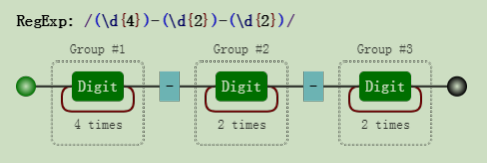

对比这两个可视化图片，我们发现，与前者相比，后者多了分组编号，如 `Group #1`。 

其实正则引擎也是这么做的，在匹配过程中，给每一个分组都开辟一个空间，用来存储每一个分组匹配到的数据。 

既然分组可以捕获数据，那么我们就可以使用它们。

#### 3.2.1. 提取数据

比如提取出年、月、日，可以这么做：

```js
var regex = /(\d{4})-(\d{2})-(\d{2})/;
var string = "2017-06-12";
console.log( string.match(regex) );
// => ["2017-06-12", "2017", "06", "12", index: 0, input: "2017-06-12"]
```

NOTE

`match` 返回的一个数组，第一个元素是整体匹配结果，然后是各个分组（括号里）匹配的内容，然后是匹配下标，最后是输入的文本。另外，正则表达式是否有修饰符 `g，match`返回的数组格式是不一样的。

另外也可以使用正则实例对象的 `exec` 方法：

```js
var regex = /(\d{4})-(\d{2})-(\d{2})/;
var string = "2017-06-12";
console.log( regex.exec(string) );
// => ["2017-06-12", "2017", "06", "12", index: 0, input: "2017-06-12"]
```

同时，也可以使用构造函数的全局属性 `$1` 至 `$9` 来获取：

```js
var regex = /(\d{4})-(\d{2})-(\d{2})/;
var string = "2017-06-12";
regex.test(string); // 正则操作即可，例如
//regex.exec(string);
//string.match(regex);
console.log(RegExp.$1); // "2017"
console.log(RegExp.$2); // "06"
console.log(RegExp.$3); // "12"
```

#### 3.2.2. 替换

比如，想把 `yyyy-mm-dd` 格式，替换成 `mm/dd/yyyy` 怎么做？

```js
var regex = /(\d{4})-(\d{2})-(\d{2})/;
var string = "2017-06-12";
var result = string.replace(regex, "$2/$3/$1");
console.log(result);
// => "06/12/2017"
```

其中 `replace` 中的，第二个参数里用 `$1、$2、$3` 指代相应的分组。等价于如下的形式：

```js
var regex = /(\d{4})-(\d{2})-(\d{2})/;
var string = "2017-06-12";
var result = string.replace(regex, function () {
  return RegExp.$2 + "/" + RegExp.$3 + "/" + RegExp.$1;
});
console.log(result);
// => "06/12/2017"
```

也等价于：

```js
var regex = /(\d{4})-(\d{2})-(\d{2})/;
var string = "2017-06-12";
var result = string.replace(regex, function (match, year, month, day) {
  return month + "/" + day + "/" + year;
});
console.log(result);
// => "06/12/2017"
```

### 3.3. 反向引用 

除了使用相应 `API` 来引用分组，也可以在正则本身里引用分组。但只能引用之前出现的分组，即反向引用。

还是以日期为例。

比如要写一个正则支持匹配如下三种格式：

```js
2016-06-12
2016/06/12
2016.06.12
```

最先可能想到的正则是:

```js
var regex = /\d{4}(-|\/|\.)\d{2}(-|\/|\.)\d{2}/;
var string1 = "2017-06-12";
var string2 = "2017/06/12";
var string3 = "2017.06.12";
var string4 = "2016-06/12";
console.log( regex.test(string1) ); // true
console.log( regex.test(string2) ); // true
console.log( regex.test(string3) ); // true
console.log( regex.test(string4) ); // true
```

其中 `/` 和 `.` 需要转义。虽然匹配了要求的情况，但也匹配 `"2016-06/12"` 这样的数据。

假设我们想要求分割符前后一致怎么办？此时需要使用反向引用：

```js
var regex = /\d{4}(-|\/|\.)\d{2}\1\d{2}/;
var string1 = "2017-06-12";
var string2 = "2017/06/12";
var string3 = "2017.06.12";
var string4 = "2016-06/12";
console.log( regex.test(string1) ); // true
console.log( regex.test(string2) ); // true
console.log( regex.test(string3) ); // true
console.log( regex.test(string4) ); // false
```

注意里面的 `\1`，表示的引用之前的那个分组 `(-|\/|\.)`。不管它匹配到什么`（比如 -）`，`\1` 都匹配那个同 样的具体某个字符。 

我们知道了 `\1` 的含义后，那么 `\2` 和 `\3` 的概念也就理解了，即分别指代第二个和第三个分组。

看到这里，此时，恐怕你会有几个问题。

#### 3.3.1. 括号嵌套怎么办？

以左括号（开括号）为准。比如：

```js
var regex = /^((\d)(\d(\d)))\1\2\3\4$/;
var string = "1231231233";
console.log( regex.test(string) ); // true
console.log( RegExp.$1 ); // 123
console.log( RegExp.$2 ); // 1
console.log( RegExp.$3 ); // 23
console.log( RegExp.$4 ); // 3
```

我们可以看看这个正则匹配模式：

第一个字符是数字，比如说 `"1"`， 

第二个字符是数字，比如说 `"2"`，

第三个字符是数字，比如说 `"3"`，

接下来的是 `\1`，是第一个分组内容，那么看第一个开括号对应的分组是什么，是 `"123"`，

接下来的是 `\2`，找到第2个开括号，对应的分组，匹配的内容是 `"1"`，

接下来的是 `\3`，找到第3个开括号，对应的分组，匹配的内容是 `"23"`，

最后的是 `\4`，找到第3个开括号，对应的分组，匹配的内容是 `"3"`。

我们可以看看这个正则匹配模式：

第一个字符是数字，比如说 `"1"`， 

第二个字符是数字，比如说 `"2"`，

第三个字符是数字，比如说 `"3"`，

接下来的是 `\1`，是第一个分组内容，那么看第一个开括号对应的分组是什么，是 `"123"，`

接下来的是 `\2`，找到第2个开括号，对应的分组，匹配的内容是 `"1"`，

接下来的是 `\3`，找到第3个开括号，对应的分组，匹配的内容是 `"23"`，

最后的是 `\4`，找到第3个开括号，对应的分组，匹配的内容是 `"3"`。

#### 3.3.2. `\10` 表示什么呢？

另外一个疑问可能是，即 `\10` 是表示第 `10` 个分组，还是 `\1` 和 `0` 呢？

答案是前者，虽然一个正则里出现 `\10` 比较罕见。测试如下：

```js
var regex = /(1)(2)(3)(4)(5)(6)(7)(8)(9)(#) \10+/;
var string = "123456789# ######"
console.log( regex.test(string) );
// => true
```

TIP 如果真要匹配 `\1` 和 `0` 的话，请使用 `(?:\1)0` 或者 `\1(?:0)`。

#### 3.3.3. 引用不存在的分组会怎样？ 

因为反向引用，是引用前面的分组，但我们在正则里引用了不存在的分组时，此时正则不会报错，只是匹配反向引用的字符本身。例如 `\2`，就匹配 `"\2"`。注意 `"\2"` 表示对 `"2"` 进行了转义。

```js
var regex = /\1\2\3\4\5\6\7\8\9/;
console.log( regex.test("\1\2\3\4\5\6\7\8\9") );
console.log( "\1\2\3\4\5\6\7\8\9".split("") );
```

`Chrome` 浏览器打印的结果（不同的浏览器和版本，打印的结果可能不一样）：

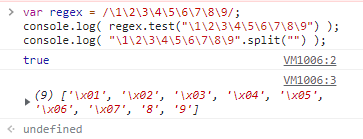

#### 3.3.4. 分组后面有量词会怎样？ 

分组后面有量词的话，分组最终捕获到的数据是最后一次的匹配。比如如下的测试案例：

```js
var regex = /(\d)+/;
var string = "12345";
console.log( string.match(regex) );
// => ["12345", "5", index: 0, input: "12345"]
```

从上面看出，分组 `(\d)` 捕获的数据是 `"5"`。 

同理对于反向引用，也是这样的。测试如下：

```js
var regex = /(\d)+ \1/;
console.log( regex.test("12345 1") );
// => false
console.log( regex.test("12345 5") );
// => true
```

### 3.4. 非捕获括号

之前文中出现的括号，都会捕获它们匹配到的数据，以便后续引用，因此也称它们是**捕获型分组**和**捕获型分支**。

如果只想要括号最原始的功能，但不会引用它，即，既不在 `API` 里引用，也不在正则里反向引用。

此时可以使用非捕获括号 `(?:p)` 和 `(?:p1|p2|p3)`，例如本章第一个例子可以修改为：

```js
var regex = /(?:ab)+/g;
var string = "ababa abbb ababab";
console.log( string.match(regex) );
// => ["abab", "ab", "ababab"]
```

同理，第二例子可以修改为：

```js
var regex = /^I love (?:JavaScript|Regular Expression)$/;
console.log( regex.test("I love JavaScript") );
console.log( regex.test("I love Regular Expression") );
// => true
// => true
```

### 3.5. 相关案例

至此括号的作用已经讲完了，总结一句话，就是提供了可供我们使用的分组，如何用就看我们的了。

#### 3.5.1. 字符串 `trim` 方法模拟

`trim` 方法是去掉字符串的开头和结尾的空白符。有两种思路去做。 

第一种，匹配到开头和结尾的空白符，然后替换成空字符。如：

```js
function trim(str) {
  return str.replace(/^\s+|\s+$/g, ''); }
console.log( trim(" foobar ") );
// => "foobar"
```

第二种，匹配整个字符串，然后用引用来提取出相应的数据：

```js
function trim (str) {
  return str.replace(/^\s*(.*?)\s*$/g, "$1"); }
console.log( trim(" foobar ") );
// => "foobar"
```

这里使用了惰性匹配 `*?`，不然也会匹配最后一个空格之前的所有空格的。

当然，前者效率高。

#### 3.5.2. 将每个单词的首字母转换为大写

```js
function titleize (str) {
  return str.toLowerCase().replace(/(?:^|\s)\w/g, function (c) {
  return c.toUpperCase();
  }); }
console.log( titleize('my name is epeli') );
// => "My Name Is Epeli"
```

思路是找到每个单词的首字母，当然这里不使用非捕获匹配也是可以的。

#### 3.5.3. 驼峰化

```js
function camelize (str) {
  return str.replace(/[-_\s]+(.)?/g, function (match, c) {
  return c ? c.toUpperCase() : '';
  }); }
console.log( camelize('-moz-transform') );
// => "MozTransform
```

驼峰化的逆过程。

#### 3.5.5. `HTML` 转义和反转义

```js
// 将HTML特殊字符转换成等值的实体
function escapeHTML (str) {
  var escapeChars = {
  '<' : 'lt',
  '>' : 'gt',
  '"' : 'quot',
  '&' : 'amp',
  '\'' : '#39'
  };
  return str.replace(new RegExp('[' + Object.keys(escapeChars).join('') +']', 'g'),
function (match) {
  return '&' + escapeChars[match] + ';';
  }); }
console.log( escapeHTML('<div>Blah blah blah</div>') );
// => "&lt;div&gt;Blah blah blah&lt;/div&gt";
```

其中使用了用构造函数生成的正则，然后替换相应的格式就行了，这个跟本章没多大关系。

倒是它的逆过程，使用了括号，以便提供引用，也很简单，如下：

```js
// 实体字符转换为等值的HTML。
function unescapeHTML (str) {
  var htmlEntities = {
  nbsp: ' ',
  lt: '<',
  gt: '>',
  quot: '"',
  amp: '&',
  apos: '\''
  };
  return str.replace(/\&([^;]+);/g, function (match, key) {
  if (key in htmlEntities) {
  return htmlEntities[key];
  }
  return match;
  }); }
console.log( unescapeHTML('&lt;div&gt;Blah blah blah&lt;/div&gt;') );
// => "<div>Blah blah blah</div>"
```

通过 `key` 获取相应的分组引用，然后作为对象的键。

#### 3.5.6. 匹配成对标签 

要求匹配：

```js
<title>regular expression</title>
<p>laoyao bye bye</p>
```

不匹配：

```js
<title>wrong!</p>
```

匹配一个开标签，可以使用正则 `<[^>]+>`，

匹配一个闭标签，可以使用 `<\/[^>]+>`，

但是要求匹配成对标签，那就需要使用反向引用，如：

```js
var regex = /<([^>]+)>[\d\D]*<\/\1>/;
var string1 = "<title>regular expression</title>";
var string2 = "<p>laoyao bye bye</p>";
var string3 = "<title>wrong!</p>";
console.log( regex.test(string1) ); // true
console.log( regex.test(string2) ); // true
console.log( regex.test(string3) ); // false
```

其中开标签 `<[\^>]+>` 改成 `<([^>]+)>`，使用括号的目的是为了后面使用**反向引用**，而提供分组。

闭标签使用了反向引用，`<\/\1>`。

另外，`[\d\D]`的意思是，这个字符是**数字或者不是数字**，因此，也就是匹配任意字符的意思。

### 3.6 本章小结 

重点理解括号可以提供分组，我们可以提取数据，应该就可以了。

## 4. 第四章 正则表达式回溯法原理


学习正则表达式，是需要懂点儿匹配原理的。

而研究匹配原理时，有两个字出现的频率比较高：“回溯”。 

听起来挺高大上，事实上却是一个比较容易理解的概念。 

因此，本章就简单扼要地说清楚回溯到底是什么东西。

内容包括： 

**没有回溯的匹配**

**有回溯的匹配**

**常见的回溯形式**

### 4.1. 没有回溯的匹配

假设我们的正则是 `/ab{1,3}c/`，其可视化形式是：

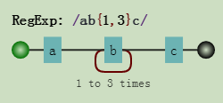

而当目标字符串是 `"abbbc"` 时，就没有所谓的“回溯”。其匹配过程是：

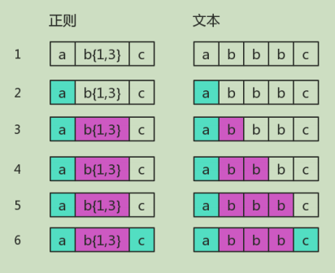

其中子表达式 `b{1,3}` 表示 `"b"` 字符连续出现 `1` 到 `3` 次。

### 4.2. 有回溯的匹配

如果目标字符串是`"abbc"`，中间就有回溯。

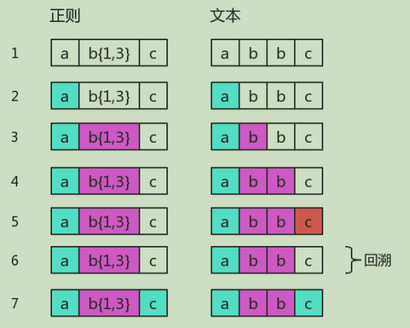

图中第 `5` 步有红颜色，表示匹配不成功。此时 `b{1,3}` 已经匹配到了 `2` 个字符 `"b"`，准备尝试第三个时，

结果发现接下来的字符是 `"c"`。那么就认为 `b{1,3}` 就已经匹配完毕。然后状态又回到之前的状态（即 第 `6` 步与第 `4` 步一样），

最后再用子表达式 `c`，去匹配字符 `"c"`。当然，此时整个表达式匹配成功了。

图中的第 `6` 步，就是`“回溯”`。

你可能对此没有感觉，这里我们再举一个例子。正则是：

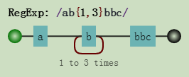

目标字符串是`"abbbc"`，匹配过程是：

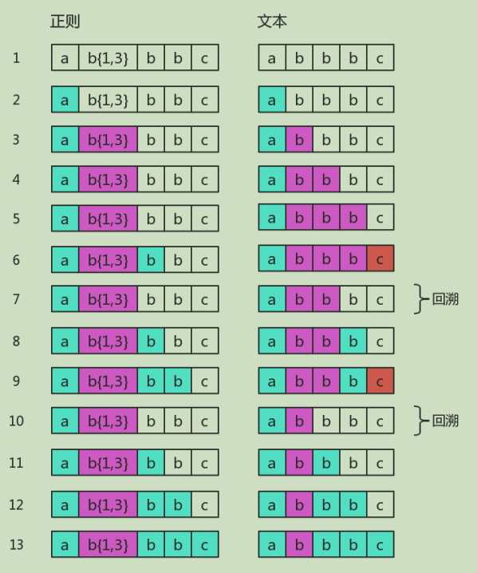

其中第 `7` 步和第 `10` 步是回溯。第 `7` 步与第 `4` 步一样，此时 `b{1,3}` 匹配了两个 `"b"`，

而第 `10` 步与 第 `3` 步一样，此时 `b{1,3}` 只匹配了一个 `"b"`，这也是 `b{1,3}` 的最终匹配结果。

这里再看一个清晰的回溯，正则是：

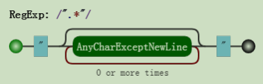

目标字符串是：`"abc"de`，匹配过程是：

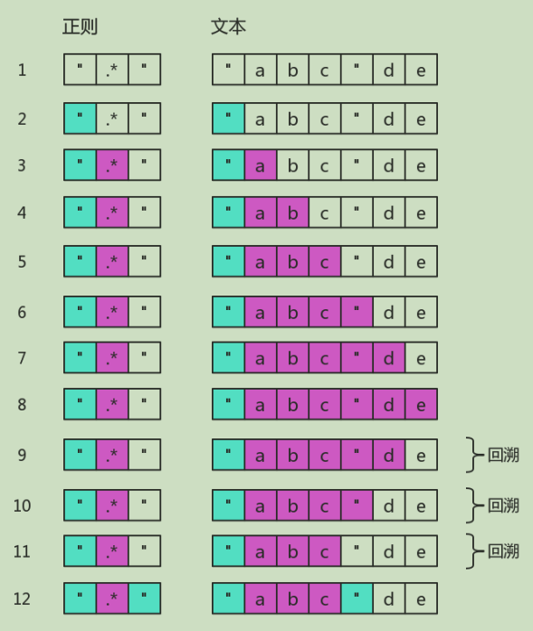

图中省略了尝试匹配双引号失败的过程。可以看出 `.*` 是非常影响效率的。

为了减少一些不必要的回溯，可以把正则修改为 `/"[^"]*"/。`

### 4.3. 常见的回溯形式

正则表达式匹配字符串的这种方式，有个学名，叫**回溯法**。

> 回溯法也称试探法，它的基本思想是：从问题的某一种状态（初始状态）出发，搜索从这种状态出发所能达到的所有“状态”，当一条路走到“尽头”的时候（不能再前进），再后退一步或若干步，从另一种可能“状态”出发，继续搜索，直到所有的“路径”（状态）都试探过。这种不断“前进”、 不断“回溯”寻找解的方法，就称作“回溯法”。 — 百度百科

本质上就是**深度优先搜索算法**。其中退到之前的某一步这一过程，我们称为`“回溯”`。从上面的描述过程中，可以看出，路走不通时，就会发生“回溯”。即，尝试匹配失败时，接下来的一步通常就是回溯。 

道理，我们是懂了。那么 `JavaScript` 中正则表达式会产生回溯的地方都有哪些呢？

#### 4.3.1 贪婪量词

之前的例子都是贪婪量词相关的。比如 `b{1,3}`，因为其是贪婪的，尝试可能的顺序是从多往少的方向去尝 试。

首先会尝试 `"bbb"`，然后再看整个正则是否能匹配。不能匹配时，吐出一个 `"b"`，即在 `"bb"` 的基础上，再继续尝试。

如果还不行，再吐出一个，再试。如果还不行呢？只能说明匹配失败了。

虽然局部匹配是贪婪的，但也要满足整体能正确匹配。否则，皮之不存，毛将焉附？

此时我们不禁会问，如果当多个贪婪量词挨着存在，并相互有冲突时，此时会是怎样？ 

答案是，先下手为强！因为深度优先搜索。测试如下：

```js
var string = "12345";
var regex = /(\d{1,3})(\d{1,3})/;
console.log( string.match(regex) );
// => ["12345", "123", "45", index: 0, input: "12345"]
```

其中，前面的 `\d{1,3}` 匹配的是 `"123"`，后面的 `\d{1,3}` 匹配的是 `"45"`。

#### 4.3.2 惰性量词

惰性量词就是在贪婪量词后面加个问号。表示**尽可能少的匹配**，比如：

```js
var string = "12345";
var regex = /(\d{1,3}?)(\d{1,3})/;
console.log( string.match(regex) );
// => ["1234", "1", "234", index: 0, input: "12345"]
```

其中 `\d{1,3}?` 只匹配到一个字符 `"1"`，而后面的 `\d{1,3}` 匹配了 `"234"`。 

**虽然惰性量词不贪，但也会有回溯的现象**。比如正则是：

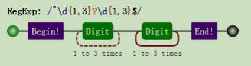

目标字符串是 `"12345"`，匹配过程是：

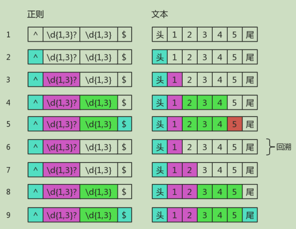

知道你不贪、很知足，但是为了整体匹配成，没办法，也只能给你多塞点了。因此最后 `\d{1,3}?` 匹配的字 符是 `"12"`，是两个数字，而不是一个。

#### 4.3.3 分支结构 

我们知道分支也是惰性的，比如 `/can|candy/`，去匹配字符串 `"candy"`，得到的结果是 `"can"`，因为分支会一个一个尝试，如果前面的满足了，后面就不会再试验了。

**分支结构**，可能前面的**子模式**会形成了**局部匹配**，如果接下来表达式整体不匹配时，仍会继续尝试剩下的分支。这种尝试也可以看成一种回溯。

比如正则：

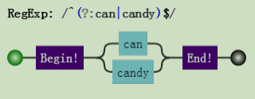

目标字符串是 `"candy"`，匹配过程：

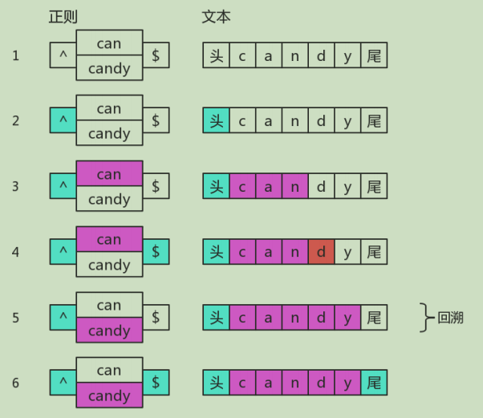

上面第 `5` 步，虽然没有回到之前的状态，但仍然回到了分支结构，尝试下一种可能。所以，可以认为它是 一种回溯的。

### 4.4. 本章小结 

其实回溯法，很容易掌握的。

简单总结就是，正因为有多种可能，所以要一个一个试。直到，要么到某一步时，整体匹配成功了；要么最 后都试完后，发现整体匹配不成功。

贪婪量词“试”的策略是：**买衣服砍价**。价钱太高了，便宜点，不行，再便宜点。

惰性量词“试”的策略是：**卖东西加价**。给少了，再多给点行不，还有点少啊，再给点。

分支结构“试”的策略是：**货比三家**。这家不行，换一家吧，还不行，再换。

既然有**回溯**的过程，那么**匹配效率肯定低一些**。相对谁呢？相对那些 `DFA` 引擎, `DFA` 是“确定型有限自动 机”的简写。

而 `JavaScript` 的正则引擎是 `NFA，NFA` 是“非确定型有限自动机”的简写。

大部分语言中的正则都是 `NFA`，为啥它这么流行呢？

答：你别看我匹配慢，但是我编译快啊，而且我还有趣哦。

## 5. 第五章 正则表达式的拆分

对于一门语言的掌握程度怎么样，可以有两个角度来衡量：读和写。

不仅要求自己能解决问题，还要看懂别人的解决方案。代码是这样，正则表达式也是这样。

正则这门语言跟其他语言有一点不同，它通常就是一大堆字符，而没有所谓“语句”的概念。 

如何能正确地把一大串正则拆分成一块一块的，成为了破解“天书”的关键。

本章就解决这一问题，内容包括： 

结构和操作符 

注意要点

案例分析

### 5.1. 结构和操作符

编程语言一般都有操作符。只要有操作符，就会出现一个问题。当一大堆操作在一起时，先操作谁，又后操作谁呢？为了不产生歧义，就需要语言本身定义好操作顺序，即所谓的优先级。

而在正则表达式中，操作符都体现在结构中，即由**特殊字符**和**普通字符**所代表的一个个特殊整体。

`JavaScript` 正则表达式中，都有哪些结构呢？

**字符字面量**、**字符组**、**量词**、**锚**、**分组**、**选择分支**、**反向引用**。

具体含义简要回顾如下：

| 结构   | 说明                                                                                                                                                                                                                       |
| ------ | -------------------------------------------------------------------------------------------------------------------------------------------------------------------------------------------------------------------------- |
| 字面量 | 匹配一个具体字符，包括**不用转义的和需要转义**的。比如 `a` 匹配字符 `"a"`， 又比如 `\n` 匹配**换行符**，又比如 `\.` 匹配**小数点**。                                                                                       |
| 字符组 | 匹配一个字符，可以是多种可能之一，比如 `[0-9]`，表示**匹配一个数字**。也有 `\d` 的简写形式。另外还有**反义字符组**，表示可以是除了特定字符之外任何一个字符，比如 `[^0-9]`， 表示一个**非数字字符**，也有 `\D` 的简写形式。 |
| 量词   | 表示一个字符连续出现，比如 `a{1,3}` 表示 `"a"` 字符连续出现 `3` 次。另外还有常见的简写形式，比如 `a+` 表示 `"a"` 字符连续出现至少一次。                                                                                    |
| 锚     | 匹配一个位置，**而不是字符**。比如 `^` 匹配字符串的开头，又比如 `\b` 匹配**单词边界**， 又比如 `(?=\d)` 表示**数字前面的位置**。                                                                                           |
| 分组   | 用括号表示一个整体，比如 `(ab)+`，表示 `"ab"` 两个字符连续出现多次，也可以使用非捕获分组 `(?:ab)+`。                                                                                                                       |
| 分支   | 多个子表达式多选一，比如 `abc|bcd`，表达式匹配 `"abc" `或者 `"bcd"` 字符子串。 **反向引用**，比如 `\2`，表示引用第 `2` 个分组。                                                                                            |

其中涉及到的操作符有：

| 操作符描述         | 操作符                          | 优先级 |
| ------------------ | ------------------------------- | ------ |
| **转义符**         | `\`                             | `1`    |
| **括号和方括号**   | `(…)、(?:…)、(?=…)、(?!…)、[…]` | `2`    |
| **量词限定符**     | ` {m}、{m,n}、{m,}、?、*、+`    | `3`    |
| **位置和序列**     | `^、$、\元字符、一般字符`       | `4`    |
| **管道符（竖杠）** | `|`                             | `5`    |

上面操作符的优先级从上至下，由高到低。

这里，我们来分析一个正则：

```js
/ab?(c|de*)+|fg/
```

由于括号的存在，所以，`(c|de*)` 是一个整体结构。

在 `(c|de*)` 中，注意其中的量词 ，因此 `e` 是一个整体结构。

又因为分支结构 `|` 优先级最低，因此 `c` 是一个整体、而 `de*` 是另一个整体。 

同理，整个正则分成了 `a、b?、(…)+、f、g`。而由于分支的原因， 又可以分成 `ab?(c|de*)+` 和 `fg` 这两部分。 

希望你没被我绕晕，上面的分析可用其可视化形式描述如下：


### 5.2. 注意要点 

关于结构和操作符，还是有几点需要强调：

#### 5.2.1 匹配字符串整体问题

因为是要匹配整个字符串，我们经常会在正则前后中加上锚 `^` 和 `$`。

比如要匹配目标字符串 `"abc"` 或者 `"bcd"` 时，如果一不小心，就会写成 `/^abc|bcd$/`。

而位置字符和字符序列优先级要比竖杠高，故其匹配的结构是：

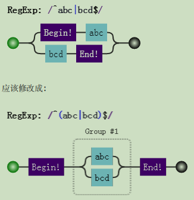

#### 5.2.2 量词连缀问题

假设，要匹配这样的字符串：

1. 每个字符为 `"a、"b"、"c"` 任选其一，
2. 字符串的长度是 `3` 的倍数。

此时正则不能想当然地写成 `/^[abc]{3}+$/`，这样会报错，说 `+` 前面没什么可重复的：

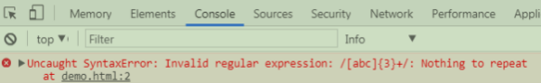

此时要修改成：

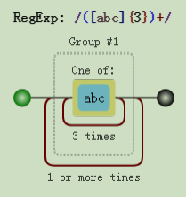

#### 5.2.3 元字符转义问题

所谓元字符，就是正则中有特殊含义的字符。

所有结构里，用到的元字符总结如下：

```js
^、$、.、*、+、?、|、\、/、(、)、[、]、{、}、=、!、:、- ,
```

当匹配上面的字符本身时，可以一律转义：

```js
var string = "^$.*+?|\\/[]{}=!:-,";
var regex = /\^\$\.\*\+\?\|\\\/\[\]\{\}\=\!\:\-\,/;
console.log( regex.test(string) );
// => true
```

其中 `string` 中的 `\` 字符也要转义的。

另外，在 `string` 中，也可以把每个字符转义，当然，转义后的结果仍是本身：

```js
var string = "^$.*+?|\\/[]{}=!:-,";
var string2 = "\^\$\.\*\+\?\|\\\/\[\]\{\}\=\!\:\-\,";
console.log( string == string2 );
// => true
```

现在的问题是，是不是每个字符都需要转义呢？否，看情况。

##### 5.2.3.1. 字符组中的元字符

跟字符组相关的元字符有 `[、]、^、-`。因此在会引起歧义的地方进行转义。例如开头的 `^` 必须转义，不然会把整个字符组，看成反义字符组。

```js
var string = "^$.*+?|\\/[]{}=!:-,";
var regex = /[\^$.*+?|\\/\[\]{}=!:\-,]/g;
console.log( string.match(regex) );
// => ["^", "$", ".", "*", "+", "?", "|", "\", "/", "[", "]", "{", "}", "=", "!", ":",
"-", ","]
```

##### 5.2.3.2. 匹配 `"[abc]"` 和 `"{3,5}"`

我们知道 `[abc]`，是个字符组。如果要匹配字符串 "[abc]" 时，该怎么办？

可以写成 `/\[abc\]/`，也可以写成 `/\[abc]/`，测试如下：

```js
var string = "[abc]";
var regex = /\[abc]/g;
console.log( string.match(regex)[0] );
// => "[abc]"
```

只需要在第一个方括号转义即可，因为后面的方括号构不成字符组，正则不会引发歧义，自然不需要转义。 

同理，要匹配字符串 `"{3,5}"`，只需要把正则写成 `/\{3,5}/` 即可。

另外，我们知道量词有简写形式 `{m,}`，却没有 `{,n}` 的情况。虽然后者不构成量词的形式，但此时并不会报 错。当然，匹配的字符串也是 `"{,n}"`，测试如下：

```js
var string = "{,3}";
var regex = /{,3}/g;
console.log( string.match(regex)[0] );
// => "{,3}"
```

##### 5.2.3.3. 其余情况

比如 `=、!、:、-、,` 等符号，只要不在特殊结构中，并不需要转义。

但是，括号需要前后都转义的，如 `/\(123\)/`。 至于剩下的 `^、$、.、*、+、?、|、\、/` 等字符，只要不在字符组内，都需要转义的。

### 5.3. 案例分析

接下来分析两个例子，一个简单的，一个复杂的。

#### 5.3.1 身份证

正则表达式是：

```js
/^(\d{15}|\d{17}[\dxX])$/
```

因为竖杠 `|` 的优先级最低，所以正则分成了两部分 `\d{15} 和 \d{17}[\dxX]。`

`\d{15}` 表示 `15` 位连续数字。

`\d{17}[\dxX]` 表示 `17` 位连续数字，最后一位可以是数字，可以大小写字母 `"x"。`

可视化如下：

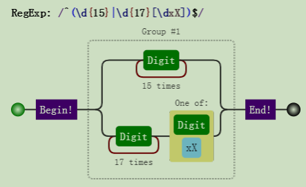

#### 5.3.2 IPV4 地址

正则表达式是：

```js
/^((0{0,2}\d|0?\d{2}|1\d{2}|2[0-4]\d|25[0-5])\.){3}(0{0,2}\d|0?\d{2}|1\d{2}|2[0-4]\d|25[0-5])$/
```

这个正则，看起来非常吓人。但是熟悉优先级后，会立马得出如下的结构：

```js
((…)\.){3}(…)
```

其中，两个 `(…)` 是一样的结构。表示匹配的是 `3` 位数字。因此整个结构是

3位数.3位数.3位数.3位数

然后再来分析 `(…)：`

```js
(0{0,2}\d|0?\d{2}|1\d{2}|2[0-4]\d|25[0-5])
```

它是一个多选结构，分成`5`个部分：

`0{0,2}\d`，匹配一位数，包括 `"0"` 补齐的。比如，`"9"、"09"、"009"；`

`0?\d{2}`，匹配两位数，包括 `"0"` 补齐的，也包括一位数；

`1\d{2}`，匹配 `"100" 到 "199";`

`2[0-4]\d`，匹配 `"200" 到 "249"；`

`25[0-5]`，匹配 `"250" 到 "255"。`

最后来看一下其可视化形式：

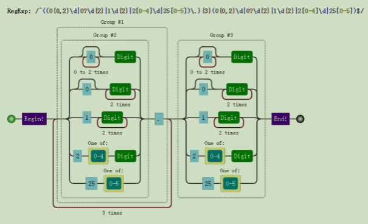

### 5.4. 本章小结

掌握正则表达式中的优先级后，再看任何正则应该都有信心分析下去了。

至于例子，不一而足，没有写太多。

这里稍微总结一下，竖杠的优先级最低，即最后运算。 只要知道这一点，就能读懂大部分正则。

另外关于元字符转义问题，当自己不确定与否时，尽管去转义，总之是不会错的。

## 6. 第六章 正则表达式的构建

对于一门语言的掌握程度怎么样，可以有两个角度来衡量：读和写。

不仅要看懂别人的解决方案，也要能独立地解决问题。代码是这样，正则表达式也是这样。 与“读”相比，“写”往往更为重要，这个道理是不言而喻的。

对正则的运用，首重就是：如何针对问题，构建一个合适的正则表达式？

本章就解决该问题，内容包括： 

**平衡法则**

**构建正则前提**

**准确性**

**效率**

### 6.1. 平衡法则

构建正则有一点非常重要，需要做到下面几点的平衡：

**匹配预期的字符串** 

**不匹配非预期的字符串**

**可读性和可维护性**

**效率**

### 6.2. 构建正则前提

#### 6.2.1. 是否能使用正则？

正则太强大了，以至于我们随便遇到一个操作字符串问题时，都会下意识地去想，用正则该怎么做。但我们始终要提醒自己，正则虽然强大，但不是万能的，很多看似很简单的事情，还是做不到的。

比如匹配这样的字符串：`1010010001…。` 

虽然很有规律，但是只靠正则就是无能为力。

#### 6.2.2. 是否有必要使用正则？ 

要认识到正则的局限，不要去研究根本无法完成的任务。同时，也不能走入另一个极端：无所不用正则。能用字符串 `API` 解决的简单问题，就不该正则出马。

比如，从日期中提取出年月日，虽然可以使用正则：

```js
var string = "2017-07-01";
var regex = /^(\d{4})-(\d{2})-(\d{2})/;
console.log( string.match(regex) );
// => ["2017-07-01", "2017", "07", "01", index: 0, input: "2017-07-01"]
```

其实，可以使用字符串的 `split` 方法来做，即可：

```js
var string = "2017-07-01";
var result = string.split("-");
console.log( result );
// => ["2017", "07", "01"]
```

比如，判断是否有问号，虽然可以使用：

```js
var string = "?id=xx&act=search";
console.log( string.search(/\?/) );
// => 0
```

其实，可以使用字符串的 `indexOf` 方法：

```js
var string = "?id=xx&act=search";
console.log( string.indexOf("?") );
// => 0
```

比如获取子串，虽然可以使用正则：

```js
var string = "JavaScript";
console.log( string.match(/.{4}(.+)/)[1] );
// => Script
```

其实，可以直接使用字符串的 `substring` 或 `substr` 方法来做：

```js
var string = "JavaScript";
console.log( string.substring(4) );
// => Script
```

#### 6.2.3. 是否有必要构建一个复杂的正则？

比如密码匹配问题，要求密码长度 `6-12` 位，由数字、小写字符和大写字母组成，但必须至少包括 2 种字符。

```js
/(?!^[0-9]{6,12}$)(?!^[a-z]{6,12}$)(?!^[A-Z]{6,12}$)^[0-9A-Za-z]{6,12}$/
```

其实可以使用多个小正则来做：

```js
var regex1 = /^[0-9A-Za-z]{6,12}$/;
var regex2 = /^[0-9]{6,12}$/;
var regex3 = /^[A-Z]{6,12}$/;
var regex4 = /^[a-z]{6,12}$/;
function checkPassword (string) {
  if (!regex1.test(string)) return false;
  if (regex2.test(string)) return false;
  if (regex3.test(string)) return false;
  if (regex4.test(string)) return false;
  return true; }
```

### 6.3. 准确性 

所谓准确性，就是能匹配预期的目标，并且不匹配非预期的目标。

这里提到了“预期”二字，那么我们就需要知道目标的组成规则。

不然没法界定什么样的目标字符串是符合预期的，什么样的又不是符合预期的。

下面将举例说明，当目标字符串构成比较复杂时，该如何构建正则，并考虑到哪些平衡。

#### 6.3.1. 匹配固定电话

比如要匹配如下格式的固定电话号码：

```js
055188888888
0551-88888888
(0551)88888888
```

第一步，了解各部分的模式规则。

上面的电话，总体上分为**区号**和**号码**两部分（不考虑分机号和 `"+86"` 的情形）。

区号是 `"0"` 开头的 `3` 到 `4` 位数字，对应的正则是：`0\d{2,3}`， 

号码是非 `"0"` 开头的 `7` 到 `8` 位数字，对应的正则是：`[1-9]\d{6,7}，` 

因此，匹配 `"055188888888"` 的正则是：`/^0\d{2,3}[1-9]\d{6,7}$/，`

匹配 `"0551-88888888"` 的正则是：`/^0\d{2,3}-[1-9]\d{6,7}$/，`

匹配 `"(0551)88888888"` 的正则是：`/^\(0\d{2,3}\)[1-9]\d{6,7}$/。` 

第二步，明确形式关系。

这三者情形是或的关系，可以构建分支：

```js
/^0\d{2,3}[1-9]\d{6,7}$|^0\d{2,3}-[1-9]\d{6,7}$|^\(0\d{2,3}\)[1-9]\d{6,7}$/
```

提取公共部分：

```js
/^(0\d{2,3}|0\d{2,3}-|\(0\d{2,3}\))[1-9]\d{6,7}$/
```

进一步简写：

```js
/^(0\d{2,3}-?|\(0\d{2,3}\))[1-9]\d{6,7}$/
```

其可视化形式：

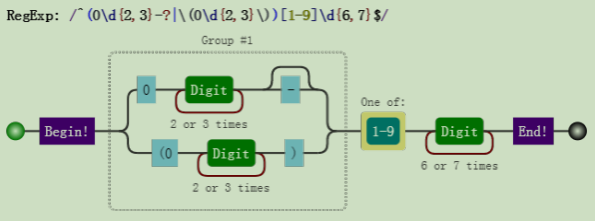

上面的正则构建过程略显罗嗦，但是这样做，能保证正则是准确的。

上述三种情形是或的关系，这一点很重要，不然很容易按字符是否出现的情形把正则写成：

```js
/^\(?0\d{2,3}\)?-?[1-9]\d{6,7}$/
```

虽然也能匹配上述目标字符串，但也会匹配 `"(0551-88888888"` 这样的字符串。当然，这不是我们想要的。

其实这个正则也不是完美的，因为现实中，并不是每个 3 位数和 4 位数都是一个真实的区号。

这就是一个平衡取舍问题，一般够用就行。

#### 6.3.2. 匹配浮点数 

要求匹配如下的格式：

```js
1.23、+1.23、-1.23
10、+10、-10
.2、+.2、-.2
```


