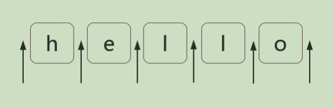

# JavaScript 正则表达式迷你书 

`javascript-regular-expressions-mini-book`

笔记：感谢这本📕的作者

正则表达式是**匹配模式**，要么**匹配字符**，要么**匹配位置**

对于位置的理解，我们可以理解成**空字符**

第一章 正则表达式**字符匹配**攻略

第二章 正则表达式**位置匹配**攻略

第三章 正则表达式**括号的作用**

第四章 正则表达式**回溯法原理**

第五章 正则表达式的**拆分** 

第六章 正则表达式的**构建**

第七章 正则表达式**编程**

### 每一章都讨论了什么？

> 正则是**匹配模式**，要么**匹配字符**，要么**匹配位置**。

第一章和第二章以这个角度去讲解了正则表达式的基础。

> 在正则可以**使用括号捕获数据**，要么在 `API` 中进行**分组引用**，要么在正则里进行**反向引用**。

第三章的主题，讲解了正则表达式中**括号的作用**。

> 学习正则，是需要了解其匹配原理的。

第四章，讲解了正则表达式的**回溯法原理**。

第五章，是从读的角度，去**拆分一个正则表达式**，而第六章是从写的角度，去**构建一个正则表达式**。

第七章讲解了**正则的用法**，和相关 `API` 需要注意的地方。

## 第一章 正则表达式**字符匹配**攻略

> 正则表达式是**匹配模式**，要么**匹配字符**，要么**匹配位置**。

元字符太多了，看起来没有系统性，不好记。

内容包括：

**两种模糊匹配**

**字符组**

**量词**

**分支结构**

**案例分析**

### 1.1. 两种模糊匹配

如果正则只有精确匹配是没多大意义的，比如 `/hello/`，也只能匹配字符串中的 `"hello"` 这个子串。

```js
var regex = /hello/;
console.log( regex.test("hello") );
// => true
```

正则表达式之所以强大，是因为其能实现模糊匹配。 而模糊匹配，有两个方向上的“模糊”：横向模糊和纵向模糊。

#### 1.1.1. 横向模糊匹配

横向模糊指的是，一个正则可匹配的字符串的长度不是固定的，可以是多种情况的。

其实现的方式是**使用量词**。譬如 `{m,n}`，表示连续出现最少 `m` 次，最多 `n` 次。

比如正则 `/ab{2,5}c/` 表示匹配这样一个字符串：第一个字符是 "`a`"，接下来是 `2` 到 `5` 个字符 "`b`"，最后
是字符 "`c`"。

测试如下：
```js
var regex = /ab{2,5}c/g;
var string = "abc abbc abbbc abbbbc abbbbbc abbbbbbc";
console.log( string.match(regex) );
// => ["abbc", "abbbc", "abbbbc", "abbbbbc"]
```

> NOTE

:::tip
案例中用的正则是 `/ab{2,5}c/g`，其中 `g` 是正则的一个修饰符。表示全局匹配，即，在目 标字符串中按顺序找到满足匹配模式的所有子串，强调的是“所有”，而不只是“第一个” `。g` 是单词 `global` 的首字母。
:::

#### 1.1.2. 纵向模糊匹配

纵向模糊指的是，一个正则匹配的字符串，具体到某一位字符时，它可以不是某个确定的字符，可以有多种可能。

:::warning
其实现的方式是使用**字符组**。
:::

譬如 `[abc]`，表示该字符是可以字符 `"a"、"b"、"c"` 中的任何一个。
比如 `/a[123]b/` 可以匹配如下三种字符串： `"a1b"、"a2b"、"a3b"`

测试如下：
```js
var regex = /a[123]b/g;
var string = "a0b a1b a2b a3b a4b";
console.log( string.match(regex) );
// => ["a1b", "a2b", "a3b"]
```

以上就是本章讲的主体内容，只要掌握横向和纵向模糊匹配，就能解决很大部分正则匹配问题。

### 1.2. 字符组 

需要强调的是，虽叫**字符组**（字符类），但只是其中一个字符。 例如 `[abc]`，表示匹配一个字符，它可以是 `"a"、"b"、"c"` 之一。

#### 1.2.1. 范围表示法

如果字符组里的字符特别多的话，怎么办？可以使用范围表示法。

比如 `[123456abcdefGHIJKLM]`，可以写成 `[1-6a-fG-M]`。用连字符 - 来省略和简写。

因为连字符有特殊用途，那么要匹配 `"a"、"-"、"z"` 这三者中任意一个字符，该怎么做呢？

不能写成 `[a-z]`，因为其表示小写字符中的任何一个字符。

可以写成如下的方式：`[-az]` 或 `[az-] 或 [a\-z]`。 即要么放在开头，要么放在结尾，要么转义。总之不会让引擎认为是范围表示法就行了。

#### 1.2.2. 排除字符组 

纵向模糊匹配，还有一种情形就是，某位字符可以是任何东西，但就不能是 `"a"、"b"、"c"`。

此时就是**排除字符组**（反义字符组）的概念。例如 `[^abc]`，表示是一个除 `"a"、"b"、"c"`之外的任意一个字 符。字符组的第一位放 `^`（**脱字符**），表示求反的概念。

当然，也有相应的范围表示法。

#### 1.2.3. 常见的简写形式

有了字符组的概念后，一些常见的符号我们也就理解了。因为它们都是系统自带的简写形式。

| 字符组 | 具体含义                                                                                                                                                                         |
| ------ | -------------------------------------------------------------------------------------------------------------------------------------------------------------------------------- |
| `\d`   | 表示 `[0-9]`。表示是**一位数字**。 记忆方式：其英文是 `digit（数字）。`                                                                                                          |
| `\D`   | 表示 `[^0-9]`。表示**除数字外的任意字**符。                                                                                                                                      |
| `\w`   | 表示 `[0-9a-zA-Z_]`。表示**数字、大小写字母和下划线**。 记忆方式：`w` 是 `word` 的简写，也称**单词字符**。                                                                       |
| `\W`   | 表示 `[^0-9a-zA-Z_]`。**非单词字符**。                                                                                                                                           |
| `\s`   | 表示 `[ \t\v\n\r\f]`。表示**空白符**，包括**空格、水平制表符、垂直制表符、换行符、回车符、换页符**。记忆方式：`s` 是 `space` 的首字母，空白符的单词是 `white space`。            |
| `\S`   | 表示 `[^ \t\v\n\r\f]`。 **非空白符**。                                                                                                                                           |
| `.`    | 表示 `[^\n\r\u2028\u2029]`。通配符，表示几乎任意字符。**换行符、回车符、行分隔符和段分隔符除外**。 记忆方式：想想省略号 `…` 中的每个点，都可以理解成占位符，表示任何类似的东西。 |

如果要匹配任意字符怎么办？可以使用 `[\d\D]、[\w\W]、[\s\S] 和 [^]` 中任何的一个。

### 1.3. 量词

量词也称重复。掌握 `{m,n}` 的准确含义后，只需要记住一些简写形式。

#### 1.3.1. 简写形式

| 量词   | 具体含义                                                                                                                    |
| ------ | --------------------------------------------------------------------------------------------------------------------------- |
| `{m,}` | 表示至少出现 `m` 次。                                                                                                       |
| `{m}`  | 等价于 `{m,m}`，表示出现 `m` 次。                                                                                           |
| `?`    | 等价于 `{0,1}`，表示**出现或者不出现**。记忆方式：问号的意思表示，有吗？                                                    |
| `+`    | 等价于 `{1,}`，表示**出现至少一次**。 记忆方式：加号是追加的意思，得先有一个，然后才考虑追加。                              |
| `*`    | 等价于 `{0,}`，表示**出现任意次**，有可能不出现。记忆方式：看看天上的星星，可能一颗没有，可能零散有几颗，可能数也数不过来。 |

#### 1.3.2. 贪婪匹配与惰性匹配

看如下的例子：
```js
var regex = /\d{2,5}/g;
var string = "123 1234 12345 123456";
console.log( string.match(regex) );
// => ["123", "1234", "12345", "12345"]
```
其中正则 `/\d{2,5}/`，表示数字连续出现 `2` 到 `5` 次。会匹配 `2 位、3 位、4 位、5 位`连续数字。

但是其是贪婪的，它会尽可能多的匹配。你能给我 `6` 个，我就要 `5` 个。你能给我 `3` 个，我就要 `3` 个。

反正只要在能力范围内，越多越好。 我们知道有时贪婪不是一件好事。而惰性匹配，就是尽可能少的匹配：
```js
var regex = /\d{2,5}?/g;
var string = "123 1234 12345 123456";
console.log( string.match(regex) );
// => ["12", "12", "34", "12", "34", "12", "34", "56"]
```
其中 `/\d{2,5}?/` 表示，虽然 2 到 5 次都行，当 2 个就够的时候，就不再往下尝试了。

通过在量词后面加个问号就能实现惰性匹配，因此所有惰性匹配情形如下：

| 惰性量词 | 贪婪量词 |
| -------- | -------- |
| `{m,n}?` | `{m,n}`  |
| `{m,}?`  | `{m,}`   |
| `??`     | `?`      |
| `+?`     | `+`      |
| `*?`     | `*`      |

:::tip
TIP 对惰性匹配的记忆方式是：量词后面加个问号，问一问你知足了吗，你很贪婪吗？
:::

### 1.4. 多选分支

一个模式可以实现横向和纵向模糊匹配。而多选分支可以支持多个子模式任选其一。

具体形式如下：`(p1|p2|p3)`，其中 `p1、p2 和 p3` 是子模式，用 `|`（管道符）分隔，表示其中任何之一。

例如要匹配字符串 "`good`" 和 "`nice`" 可以使用 `/good|nice/`。

测试如下：
```js
var regex = /good|nice/g;
var string = "good idea, nice try.";
console.log( string.match(regex) );
// => ["good", "nice"]
```
但有个事实我们应该注意，比如我用 `/good|goodbye/`，去匹配 `"goodbye"` 字符串时，结果是 `"good"`：

```js
var regex = /good|goodbye/g;
var string = "goodbye";
console.log( string.match(regex) );
// => ["good"]
```

而把正则改成 `/goodbye|good/`，结果是：

```js
var regex = /goodbye|good/g;
var string = "goodbye";
console.log( string.match(regex) );
// => ["goodbye"]
```

也就是说，分支结构也是惰性的，即当前面的匹配上了，后面的就不再尝试了。

### 1.5. 案例分析

匹配字符，无非就是字符组、量词和分支结构的组合使用罢了。

下面找几个例子演练一下（其中，每个正则并不是只有唯一写法）：

#### 1.5.1. 匹配 16 进制颜色值 要求匹配：

```js
#ffbbad
#Fc01DF
#FFF
#ffE
```

分析： 表示一个 16 进制字符，可以用字符组 `[0-9a-fA-F]`。

其中字符可以出现 3 或 6 次，需要是用量词和分支结构。

使用分支结构时，需要注意顺序。

正则如下：

```js
var regex = /#([0-9a-fA-F]{6}|[0-9a-fA-F]{3})/g;
var string = "#ffbbad #Fc01DF #FFF #ffE";
console.log( string.match(regex) );
// => ["#ffbbad", "#Fc01DF", "#FFF", "#ffE"]
```

#### 1.5.2. 匹配时间

以 24 小时制为例。 要求匹配：

```js
23:59
02:07
```

分析： 

共 4 位数字，第一位数字可以为 `[0-2]`。 

当第 1 位为 "2" 时，第 2 位可以为 `[0-3]`，其他情况时，第 2 位为 `[0-9]`。 

第 3 位数字为 `[0-5]`，第4位为 `[0-9]`。

正则如下：

```js
var regex = /^([01][0-9]|[2][0-3]):[0-5][0-9]$/;
console.log( regex.test("23:59") );
console.log( regex.test("02:07") );
// => true
// => true
```

NOTE 正则中使用了 `^` 和 `$`，分别表示字符串开头和结尾。

如果也要求匹配 `"7:9"`，也就是说时分前面的 `"0"` 可以省略。

此时正则变成：

```js
var regex = /^(0?[0-9]|1[0-9]|[2][0-3]):(0?[0-9]|[1-5][0-9])$/;
console.log( regex.test("23:59") );
console.log( regex.test("02:07") );
console.log( regex.test("7:9") );
// => true
// => true
// => true
```

#### 1.5.3. 匹配日期

比如 `yyyy-mm-dd` 格式为例。 要求匹配：

```js
2017-06-10
```

分析： 

年，四位数字即可，可用 `[0-9]{4}`。 

月，共 12 个月，分两种情况 `"01"、"02"、…、"09" 和 "10"、"11"、"12"`，可用 `(0[1-9]|1[0-2])`。 

日，最大 31 天，可用 `(0[1-9]|[12][0-9]|3[01])`。

正则如下：
```js
var regex = /^[0-9]{4}-(0[1-9]|1[0-2])-(0[1-9]|[12][0-9]|3[01])$/;
console.log( regex.test("2017-06-10") );
// => true
```

#### 1.5.4. window 操作系统文件路径

要求匹配：
```js
F:\study\javascript\regex\regular expression.pdf
F:\study\javascript\regex\
F:\study\javascript
F:\
```

分析： 

整体模式是: 

```js
盘符:\文件夹\文件夹\文件夹\
```

其中匹配 `"F:\"`，需要使用 ``[a-zA-Z]:\\``，其中盘符不区分大小写，注意 `\` 字符需要转义。 

文件名或者文件夹名，不能包含一些特殊字符，此时我们需要排除字符组 `[^\\:*<>|"?\r\n/]` 来表示合法字符。

另外它们的名字不能为空名，至少有一个字符，也就是要使用量词 `+`。因此匹配 `文件夹\`，可用 `[^\\:*<>|"?\r\n/]+\\`。

另外 `文件夹\`，可以出现任意次。也就是 `([^\\:*<>|"?\r\n/]+\\)*`。其中括号表示其内部正则是一个整体。

路径的最后一部分可以是 `文件夹`，没有 `\`，因此需要添加 `([^\\:*<>|"?\r\n/]+)?`。

最后拼接成了一个看起来比较复杂的正则：
```js
var regex = /^[a-zA-Z]:\\([^\\:*<>|"?\r\n/]+\\)*([^\\:*<>|"?\r\n/]+)?$/;
console.log( regex.test("F:\\study\\javascript\\regex\\regular expression.pdf") );
console.log( regex.test("F:\\study\\javascript\\regex\\") );
console.log( regex.test("F:\\study\\javascript") );
console.log( regex.test("F:\\") );
// => true
// => true
// => true
// => true
```
其中，在JavaScript 中字符串要表示字符 `\` 时，也需要转义。

#### 1.5.5. 匹配 id

要求从
```js
<div id="container" class="main"></div>
```
提取出 `id="container"`。

可能最开始想到的正则是：
```js
var regex = /id=".*"/
var string = '<div id="container" class="main"></div>';
console.log(string.match(regex)[0]);
// => id="container" class="main"
```

因为 `.` 是通配符，本身就匹配双引号的，而量词 `*` 又是贪婪的，当遇到 `container` 后面双引号时，是不会停下来，会继续匹配，直到遇到最后一个双引号为止。 

解决之道，可以使用惰性匹配：

```js
var regex = /id=".*?"/
var string = '<div id="container" class="main"></div>';
console.log(string.match(regex)[0]);
// => id="container"
```

当然，这样也会有个问题。效率比较低，因为其匹配原理会涉及到“回溯”这个概念。可以优化如下：

```js
var regex = /id="[^"]*"/
var string = '<div id="container" class="main"></div>';
console.log(string.match(regex)[0]);
// => id="container
```

## 2. 第二章 正则表达式位置匹配攻略

正则表达式是匹配模式，要么匹配字符，要么匹配位置。请记住这句话。

然而大部分人学习正则时，对于匹配位置的重视程度没有那么高。

内容包括： 

- 什么是位置？ 
- 如何匹配位置？
- 位置的特性 
- 几个应用实例分析

### 2.1. 什么是位置呢？

位置（锚）是相邻字符之间的位置。比如，下图中箭头所指的地方



### 2.2. 如何匹配位置呢？

在 `ES5` 中，共有 6 个锚： `^、$、\b、\B、(?=p)、(?!p)`

#### 2.2.1. `^` 和 `$`

`^`（脱字符）匹配开头，在多行匹配中匹配行开头。 

`$`（美元符号）匹配结尾，在多行匹配中匹配行结尾。

比如我们把字符串的开头和结尾用 "`#`" 替换（位置可以替换成字符的！）：

```js
var result = "hello".replace(/^|$/g, '#');
console.log(result);
// => "#hello#"
```

多行匹配模式（即有修饰符 `m`）时，二者是行的概念，这一点需要我们注意：

```js
var result = "I\nlove\njavascript".replace(/^|$/gm, '#');
console.log(result);
/*
#I#
#love#
#javascript#
*/
```

#### 2.2.2. `\b` 和 `\B`

`\b` 是单词边界，具体就是 `\w` 与 `\W `之间的位置，也包括 `\w` 与 `^` 之间的位置，和 `\w` 与 `$` 之间的位置。

比如考察文件名 `"[JS] Lesson_01.mp4"` 中的 `\b`，如下：
```js
var result = "[JS] Lesson_01.mp4".replace(/\b/g, '#');
console.log(result);
// => "[#JS#] #Lesson_01#.#mp4#"
```

为什么是这样呢？这需要仔细看看。

首先，我们知道，`\w` 是字符组 `[0-9a-zA-Z_]` 的简写形式，即 `\w` 是字母数字或者下划线的中任何一个字符。而 `\W` 是排除字符组 `[^0-9a-zA-Z_]` 的简写形式，即 `\W` 是 `\w` 以外的任何一个字符。

此时我们可以看看 `"[#JS#] #Lesson_01#.#mp4#"` 中的每一个井号 ，是怎么来的。

第 1 个，两边字符是 ``"[" 与 "J"，是 \W 与 \w 之间``的位置。 

第 2 个，两边字符是 `"S" 与 "]"，也就是 \w 与 \W 之间`的位置。 

第 3 个，两边字符是 `空格与 "L"，也就是 \W 与 \w 之间`的位置。 

第 4 个，两边字符是 `"1" 与 "."，也就是 \w 与 \W 之间`的位置。

第 5 个，两边字符是 `"." 与 "m"，也就是 \W 与 \w之间`的位置。 

第 6 个，位于结尾，前面的字符 "4" 是 `\w`，`即 \w 与 $ 之间`的位置。

知道了 `\b` 的概念后，那么 `\B` 也就相对好理解了。

`\B` 就是 `\b` 的反面的意思，非单词边界。例如在字符串中所有位置中，扣掉 `\b`，剩下的都是 `\B` 的。

具体说来就是 `\w` 与 `\w`、 `\W` 与 `\W`、`^` 与 `\W`，`\W` 与 `$` 之间的位置。

比如上面的例子，把所有 `\B` 替换成 `"#"`：

```js
var result = "[JS] Lesson_01.mp4".replace(/\B/g, '#');
console.log(result);
// => "#[J#S]# L#e#s#s#o#n#_#0#1.m#p#4"
```


